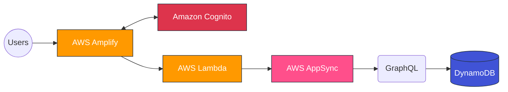

# Serverless Web Application with AWS

This project demonstrates how to build a serverless web application using AWS services. It follows the AWS Hands-on tutorial: [Build a Web App with S3, Lambda, API Gateway, DynamoDB](https://docs.aws.amazon.com/hands-on/latest/build-web-app-s3-lambda-api-gateway-dynamodb/module-one.html).

## Application Architecture

The application uses the following AWS services and flow:



## Module 1: Static Web Hosting & Environment Setup

This module focuses on setting up the local development environment, creating the React application, and establishing version control with GitHub.

### Step 1: Manual Amplify Setup
We started by manually setting up the AWS Amplify environment to host our application.

### Step 2: Create the React Application
We utilized Vite to generate a lightweight and fast React application.

**Terminal Command:**
```powershell
npm create vite@latest profilesapp -- --template react
```

**Configuration:**
*   **Framework:** React
*   **Variant:** JavaScript

**Verification:**
After installation, we started the local development server:
```powershell
cd profilesapp
npm install
npm run dev
```
This launched the application at `http://localhost:5173`, confirming the successful creation of the `profilesapp` directory.

### Step 3: Initialize Git & Connect to GitHub
We established a robust version control workflow to ensure all changes are tracked and synced.

**1. Environment Configuration:**
Before connecting, we ensured the necessary tools were installed and authenticated:
*   **Installed GitHub CLI:** `winget install --id GitHub.cli`
*   **Authenticated:** `gh auth login --web` (Verified with `gh auth status`)

**2. Repository Initialization:**
Inside the `profilesapp` directory:
```powershell
git init
git add .
git commit -m "initial react app"
```

**3. Remote Connection:**
We connected the local repository to GitHub and pushed the initial code:
```powershell
git remote add origin https://github.com/iamMichaelSmith/AWS-Web-App.git
git branch -M main
git push -u origin main
```

✅ **Milestone Reached:** The application is now version-controlled and connected to GitHub, ready for continuous integration and deployment integration with AWS Amplify.